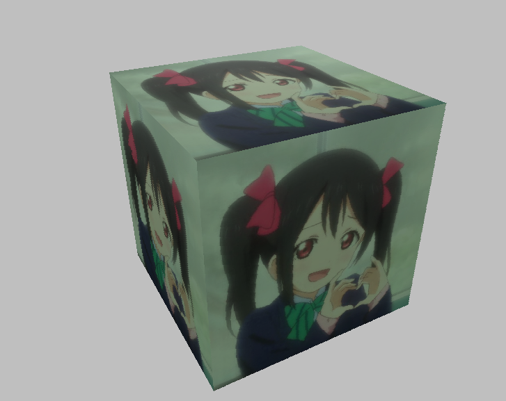

---
# Moe3D
-------------

> A soft renderder in VS2017

## Demo  


---
## Feature
- light
- render a box with textures

---
## Usage

```
 git clone https://github.com/ayanamirei1997/Moe3D

 run it in VS2017
```

---
## TODO
make an engine

---
## License
MIT License
